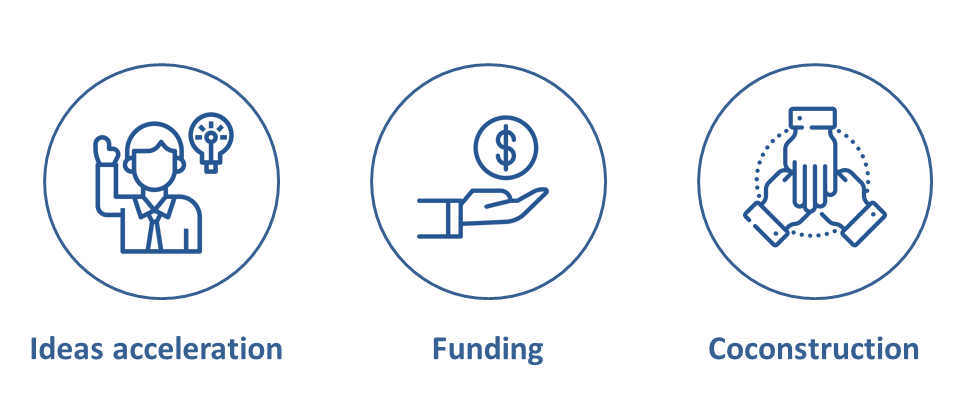

+++
title: Open call for proposals
+++

At Datalab, our ambition is to be an accelerator of innovation in emerging technologies.  

This ambition is manifold:  

* We want to create synergies between key players and co-construct high-impact projects with them.

* We want to finance innovative projects to ensure that they are carried out under the best possible conditions.

* We want to give concrete form to independent ideas, which can come from anyone, by giving them the appropriate structure and resources to carry them out.

And we need you to make this ambition a reality.  
Contact us, describe your project, whatever your idea, whatever your needs, we will make sure to get the best out of it.  

And together, we will innovate. 

+++
# Contact widget.
widget = "contact"  # See https://sourcethemes.com/academic/docs/page-builder/
headless = true  # This file represents a page section.
active = true  # Activate this widget? true/false
weight = 130  # Order that this section will appear.

title = "Contact"
subtitle = ""

# Automatically link email and phone?
autolink = true

# Email form provider
#   0: Disable email form
#   1: Netlify (requires that the site is hosted by Netlify)
#   2: formspree.io
email_form = 1
+++
